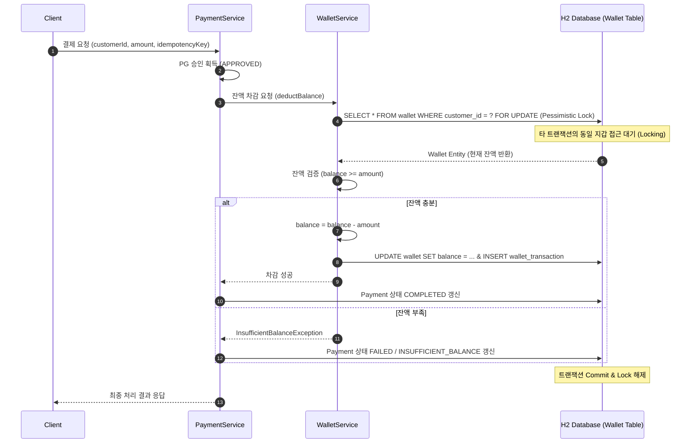
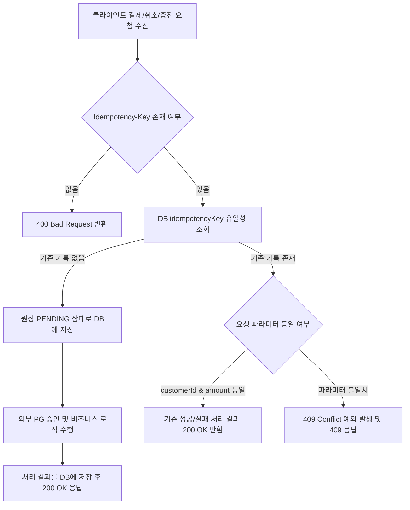
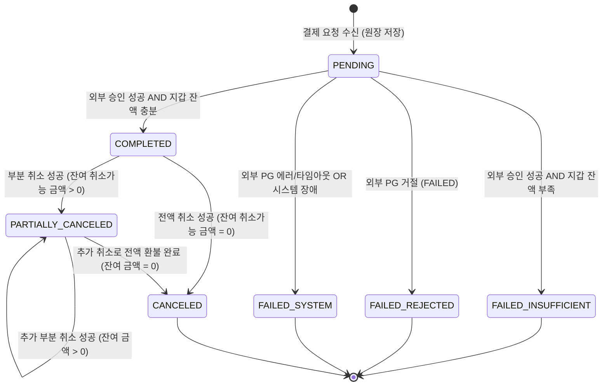
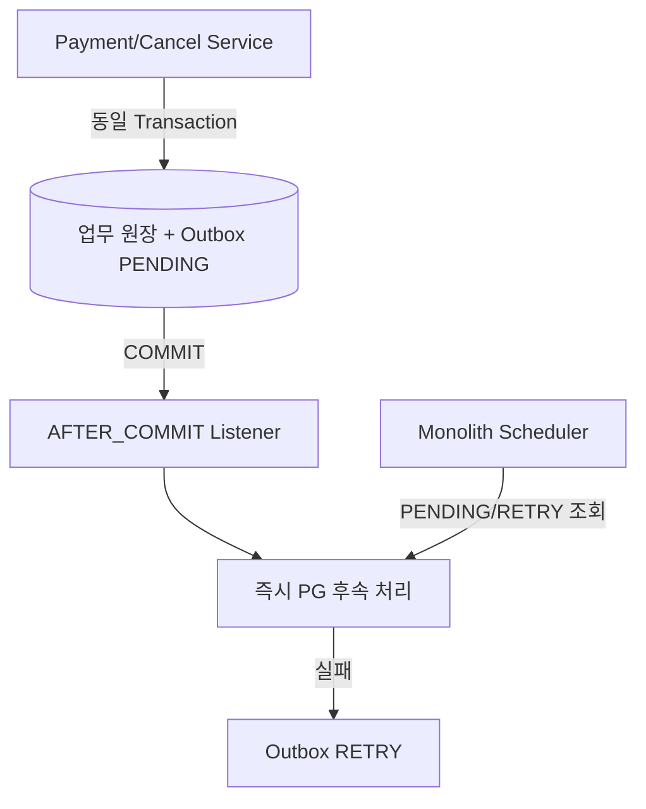
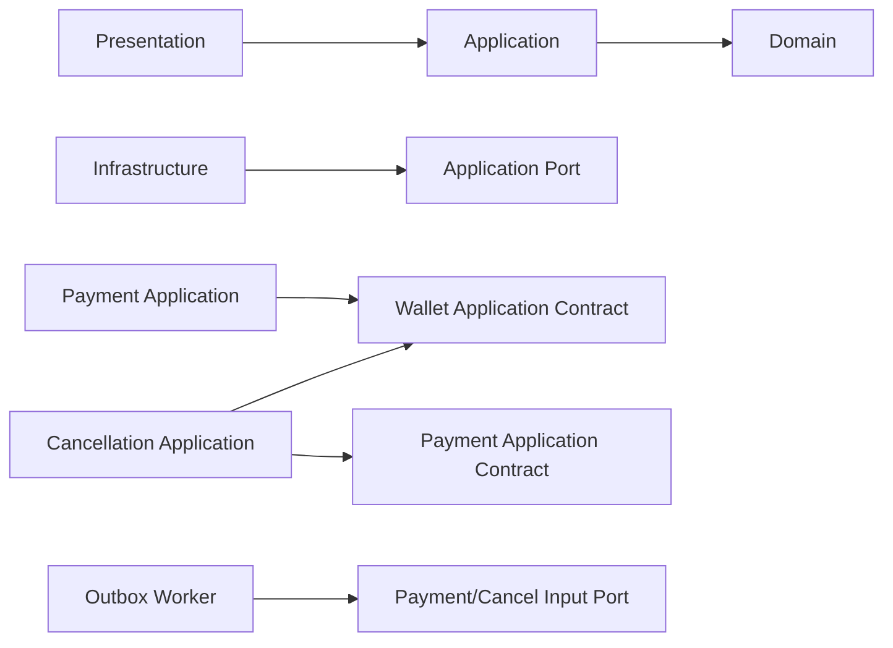

# 상세 아키텍처 정의서 (Detailed Software Architecture Document)

> 2026-08-09 재정의: 현재 목표는 독립 Worker나 도메인별 Clean Architecture가 아닌 단일 Spring Boot 레이어드 모놀리스다. 결제와 Outbox를 함께 커밋하고 커밋 후 즉시 처리하며, 동일 프로세스 Scheduler가 `PENDING/RETRY`만 복구한다.

## 1. 문서 개요 및 시스템 목적

| 항목 | 내용 |
| --- | --- |
| 문서 작성 관점 | Software Architect / Lead System Architect |
| 시스템 명칭 | PG 연동 기반 백엔드 결제 및 지갑 원장 시스템 (Payment & Wallet Subsystem) |
| 핵심 목표 | 가상 외부 PG 연동, 원장 이력 추적성 확보, 비관적 락 기반 지갑 잔액 정합성 보장, 멱등성(Idempotency) 준수 및 외부 응답 데이터 암호화 보관 |
| 기술 기준선 | Java 17, Spring Boot 3.5.16, Spring Data JPA, H2 Database (In-Memory), Flyway, JUnit 5 |

---

## 2. 시스템 아키텍처 및 계층 구조 (Layered Architecture)

본 시스템은 현재 코드량과 단일 배포 경계에 맞는 Layered Architecture를 사용한다. Domain에 업무 불변식을 유지하되 모든 도메인마다 Clean Architecture의 Port·Adapter 계층을 반복하지 않는다. 외부 PG처럼 실제 교체 경계에만 인터페이스를 두고 내부 계층은 명료한 직접 의존을 허용한다.

```
+-----------------------------------------------------------------------------------+
|                                 Presentation Layer                                |
|  - WalletController / PaymentController / PaymentQueryController                  |
|  - GlobalExceptionHandler (표준 ApiResponse<T> 직렬화 및 HTTP Status 매핑)         |
+-----------------------------------------------------------------------------------+
                                          |
                                          v
+-----------------------------------------------------------------------------------+
|                                 Application Layer                                 |
|  - PaymentService (결제/취소 전체 오케스트레이션 및 멱등성 검증)                  |
|  - WalletService (지갑 생성, 충전, 비관적 락 기반 잔액 차감/환불)                 |
|  - PaymentQueryService (고객용/운영자용 페이징 및 다이나믹 검색)                   |
+-----------------------------------------------------------------------------------+
                                          |
                     +--------------------+--------------------+
                     |                                         |
                     v                                         v
+------------------------------------------+  +-------------------------------------+
|              Domain Layer                |  |         Infrastructure Layer        |
|  - Wallet, WalletTransaction (Entity)    |  |  - FakePgClient (가상 PG 연동 모듈)  |
|  - Payment, PaymentCancel (Entity)       |  |  - AesPayloadEncryptor (AES-256)   |
|  - PgResponseLog (Entity)                |  |  - Flyway (DB Schema Migration)     |
|  - Domain Value Objects & Enums          |  |  - Spring Data JPA Repositories     |
+------------------------------------------+  +-------------------------------------+
```

### 계층별 주요 역할 및 책무

1. **Presentation Layer**:
   * 클라이언트 요청 수신 및 Bean Validation 검증.
   * `Idempotency-Key` 헤더 추출 및 Application Layer 전달.
   * 공통 `ApiResponse<T>` 포맷 형태로 응답 직렬화.
2. **Application Layer**:
   * **Spring Event 기반 트랜잭션 경계 분리 (`@TransactionalEventListener AFTER_COMMIT`)**: 
     - 원장 `PENDING` 저장 트랜잭션이 성공적으로 DB에 `COMMIT`된 직후 이벤트를 발행하여 외부 PG 연동을 호출함.
     - 외부 HTTP 연동 시에는 이미 `PENDING` 트랜잭션이 Commit되고 DB 커넥션이 반납된 상태이므로, 외부 타임아웃/지연 발생 시에도 DB Connection Pool 고사(Exhaustion)를 원천 차단함.
     - Kafka 등 외부 브로커 도입에 따른 Over-engineering 및 운용 복잡성 대신, Spring 내장 Event 엔진을 활용하여 결합도를 낮추고 테스트 가능성을 극대화함. (자세한 배경은 ADR 0002 참조)
   * 비즈니스 유효성 검증(잔액 부족, 취소 가능 한도 초과 등) 및 멱등성 검증 (`409 Conflict`).
3. **Domain Layer**:
   * 엔티티 스스로의 상태 전이 검증 (`Payment.markCompleted()`, `Wallet.decreaseBalance()`).
   * 순수 비즈니스 규칙 캡슐화 (부동 소수점 오차 방지를 위한 `Long` 또는 `BigDecimal` 정수 연산).
4. **Infrastructure Layer**:
   * 가상 외부 PG 연동 (`FakePgClient`: 승인, 거절, 에러, 타임아웃 시뮬레이션).
   * 외부 응답 원문 암호화 (`AesPayloadEncryptor`: AES-256 GCM/CBC).
   * DB 마이그레이션 (`Flyway`를 이용해 애플리케이션 시작 시 인메모리 H2 스키마 자동 구축).

---

## 3. 핵심 아키텍처 메커니즘 및 상세 설계

### 3.1 동시성 제어 전략 (Concurrency Control Architecture)

동일 지갑에 대한 동시 다발적인 결제/충전 요청 환경에서 잔액의 부적합(Negative Balance / Lost Update)을 방지하기 위해 **DB 레벨 비관적 락(Pessimistic Lock)**을 채택한다.



* **적용 메서드**: `WalletRepository.findByCustomerIdWithLock(String customerId)`
* **JPA 설정**: `@Lock(LockModeType.PESSIMISTIC_WRITE)`
* **락 타임아웃**: `@QueryHints({@QueryHint(name = "jakarta.persistence.lock.timeout", value = "3000")})` (3초 대기 후 타임아웃 예외 발생)
* **동시 취소 확장**: 동일 원 결제에 대한 부분 취소 경합은 `PaymentRepository.findByIdWithLock(Long paymentId)`의 `PESSIMISTIC_WRITE`로 누적 취소 금액 갱신을 직렬화한다.
* **잠금 순서**: 취소 완료 트랜잭션은 원 결제 잠금 후 지갑 잠금을 획득하는 순서를 일관되게 적용하여 교착 위험을 줄인다.

---

### 3.2 멱등성(Idempotency) 검증 및 처리 아키텍처

클라이언트 재시도나 중복 클릭으로 인한 중복 결제를 차단하기 위해 **글로벌 유일 멱등키 전략**을 구현한다.



* **글로벌 멱등성 선점**:
  * `idempotency_record.idempotency_key`를 기본키로 사용하여 결제·취소·충전 업무를 넘어 시스템 전체에서 키를 원자적으로 선점한다.
  * 요청 유형과 SHA-256 요청 지문을 비교해 동일 재요청과 `IDEMPOTENCY_CONFLICT`를 구분한다.
* **업무 테이블 방어적 유일성 제약**:
  * `payment.idempotency_key` (UNIQUE INDEX)
  * `payment_cancel.idempotency_key` (UNIQUE INDEX)
  * `wallet_transaction.idempotency_key` (UNIQUE INDEX)

---

### 3.3 결제 상태 전이 모델 (Payment State Machine)

결제 원장은 명확한 상태 전이 규칙을 준수하며 비정상적인 상태 변경을 차단한다.



#### 상태 및 실패 사유 매핑표
| 최종 내부 상태 | 실패 사유 (`failure_reason`) | 발생 조건 |
| --- | --- | --- |
| `COMPLETED` | `null` | 외부 PG 승인(`APPROVED`) + 지갑 잔액 충분하여 차감 완료 |
| `FAILED` | `INSUFFICIENT_BALANCE` | 외부 PG 승인(`APPROVED`) + 지갑 잔액 부족 |
| `FAILED` | `EXTERNAL_PAYMENT_REJECTED` | 외부 PG 거절(`FAILED`) |
| `FAILED` | `SYSTEM_ERROR` | 외부 PG 오류(`ERROR`), 타임아웃, 또는 내부 DB/시스템 장애 |
| `PARTIALLY_CANCELED`| `null` | 취소 요청 성공 + 누적 취소 금액 < 원 결제 금액 |
| `CANCELED` | `null` | 취소 요청 성공 + 누적 취소 금액 = 원 결제 금액 |

---

### 3.4 외부 PG 응답 원문 암호화 아키텍처 (Security Architecture)

외부 PG사의 응답 원문(Raw JSON)에는 민감정보나 운영용 개인정보가 포함될 수 있으므로, 요구사항 `EXT-002`에 따라 **애플리케이션 수준 암호화**를 적용한다.

* **암호화 알고리즘**: **AES-256-GCM (`AES/GCM/NoPadding`)**, 12바이트 무작위 IV와 128비트 인증 태그를 사용한다.
* **저장 포맷**: `v1:{Base64(IV)}:{Base64(ciphertext+tag)}`로 버전을 포함하여 향후 키 회전과 포맷 변경을 구분한다.
* **키 관리**: Base64로 인코딩된 정확히 32바이트 Secret Key를 소스코드나 DB에 저장하지 않고 환경 변수(`PAYMENT_ENCRYPTION_SECRET`)를 통해 실행 타임에 주입한다.
* **로그 분리 저장**: General Application Log(Console/File)에는 민감 원문을 절대 출력하지 않고, 전용 테이블 `pg_response_log`의 `encrypted_payload` 컬럼에 저장함.

---

## 4. 데이터베이스 물리 스키마 정의 (Flyway DDL Script)

애플리케이션 시작 시 Flyway(`db/migration/V1__init_schema.sql`)에 의해 자동으로 생성되는 DDL 스키마 정의이다.

```sql
-- 1. 고객(사용자) 테이블
CREATE TABLE customer (
    id BIGINT AUTO_INCREMENT PRIMARY KEY,
    customer_id VARCHAR(64) NOT NULL UNIQUE,
    name VARCHAR(64) NOT NULL,
    email VARCHAR(128),
    created_at TIMESTAMP NOT NULL,
    updated_at TIMESTAMP NOT NULL
);
CREATE UNIQUE INDEX idx_customer_customer_id ON customer(customer_id);

-- 2. 지갑 테이블
CREATE TABLE wallet (
    id BIGINT AUTO_INCREMENT PRIMARY KEY,
    customer_id VARCHAR(64) NOT NULL UNIQUE,
    balance BIGINT NOT NULL DEFAULT 0,
    created_at TIMESTAMP NOT NULL,
    updated_at TIMESTAMP NOT NULL,
    CONSTRAINT fk_wallet_customer FOREIGN KEY (customer_id) REFERENCES customer(customer_id)
);
CREATE UNIQUE INDEX idx_wallet_customer_id ON wallet(customer_id);

-- 3. 지갑 거래 이력 테이블
CREATE TABLE wallet_transaction (
    id BIGINT AUTO_INCREMENT PRIMARY KEY,
    wallet_id BIGINT NOT NULL,
    transaction_type VARCHAR(32) NOT NULL, -- TOP_UP, PAYMENT, REFUND
    amount BIGINT NOT NULL,
    balance_after BIGINT NOT NULL,
    payment_id BIGINT,
    cancel_id BIGINT,
    idempotency_key VARCHAR(128) UNIQUE,
    created_at TIMESTAMP NOT NULL,
    CONSTRAINT fk_wallet_tx_wallet FOREIGN KEY (wallet_id) REFERENCES wallet(id)
);

-- 4. 결제 원장 테이블
CREATE TABLE payment (
    id BIGINT AUTO_INCREMENT PRIMARY KEY,
    idempotency_key VARCHAR(128) NOT NULL UNIQUE,
    customer_id VARCHAR(64) NOT NULL,
    amount BIGINT NOT NULL,
    status VARCHAR(32) NOT NULL, -- PENDING, COMPLETED, PARTIALLY_CANCELED, CANCELED, FAILED
    failure_reason VARCHAR(64), -- INSUFFICIENT_BALANCE, SYSTEM_ERROR, EXTERNAL_PAYMENT_REJECTED
    accumulated_cancel_amount BIGINT NOT NULL DEFAULT 0,
    created_at TIMESTAMP NOT NULL,
    updated_at TIMESTAMP NOT NULL,
    CONSTRAINT fk_payment_customer FOREIGN KEY (customer_id) REFERENCES customer(customer_id)
);
CREATE INDEX idx_payment_customer_created ON payment(customer_id, created_at DESC);
CREATE INDEX idx_payment_ops_search ON payment(status, created_at DESC);

-- 4. 취소 거래 테이블
CREATE TABLE payment_cancel (
    id BIGINT AUTO_INCREMENT PRIMARY KEY,
    payment_id BIGINT NOT NULL,
    idempotency_key VARCHAR(128) NOT NULL UNIQUE,
    cancel_type VARCHAR(32) NOT NULL, -- FULL, PARTIAL
    amount BIGINT NOT NULL,
    status VARCHAR(32) NOT NULL, -- PENDING, COMPLETED, FAILED
    failure_reason VARCHAR(64),
    pg_cancel_transaction_id VARCHAR(128),
    created_at TIMESTAMP NOT NULL,
    completed_at TIMESTAMP,
    CONSTRAINT fk_cancel_payment FOREIGN KEY (payment_id) REFERENCES payment(id)
);

-- 5. 외부 PG 응답 로그 테이블 (원문 암호화 저장)
CREATE TABLE pg_response_log (
    id BIGINT AUTO_INCREMENT PRIMARY KEY,
    payment_id BIGINT NOT NULL,
    pg_transaction_id VARCHAR(128),
    pg_response_code VARCHAR(32),
    encrypted_payload CLOB NOT NULL,
    received_at TIMESTAMP NOT NULL,
    CONSTRAINT fk_pg_log_payment FOREIGN KEY (payment_id) REFERENCES payment(id)
);

-- 6. 결제 아웃박스 테이블 (Outbox-Ready Pattern)
CREATE TABLE payment_outbox (
    id BIGINT AUTO_INCREMENT PRIMARY KEY,
    payment_id BIGINT NOT NULL,
    idempotency_key VARCHAR(128) NOT NULL,
    event_type VARCHAR(64) NOT NULL,
    payload CLOB NOT NULL,
    status VARCHAR(32) NOT NULL, -- INIT, PUBLISHED, FAILED
    retry_count INT NOT NULL DEFAULT 0,
    created_at TIMESTAMP NOT NULL,
    updated_at TIMESTAMP NOT NULL
);
CREATE INDEX idx_outbox_status_created ON payment_outbox(status, created_at);

-- V3: 시스템 전체 멱등키 선점 원장
CREATE TABLE idempotency_record (
    idempotency_key VARCHAR(128) PRIMARY KEY,
    request_type VARCHAR(32) NOT NULL,
    request_fingerprint VARCHAR(64) NOT NULL,
    resource_id BIGINT,
    created_at TIMESTAMP NOT NULL,
    updated_at TIMESTAMP NOT NULL
);
```

---

## 5. 조회 API 및 응답 보안 / 페이징 아키텍처

1. **고객용 조회 API (`GET /api/v1/customers/{customerId}/payments`)**:
   * **소유권 검증**: 요청 URL/헤더의 `customerId`와 결제 원장의 `customerId` 일치 검증.
   * **정보 은닉(Data Masking)**: 외부 응답 원문(`encrypted_payload`), 내부 PG 연동 상세 에러 등은 노출하지 않고 비즈니스 상태/금액/일시만 반환.
2. **운영자용 검색 API (`GET /api/v1/ops/payments`)**:
   * **다이나믹 필터링**: `paymentId`, `customerId`, `status`, `failureReason`, `startDate`, `endDate` 조합 검색.
   * **운영 추적성**: 취소 거래 목록, 지갑 거래 참조 ID, PG 응답 로그 ID 포함.
3. **공통 페이징 규격**:
   * Page index: 1-based (클라이언트 1페이지 요청 -> JPA `PageRequest.of(page - 1, size)`)
   * 기본 Size: 20건, 최대 Size: 100건 제한
   * 정렬: `created_at DESC` 기본 적용

---

## 6. 예외 처리 및 공통 응답 규격 (Error & Response Architecture)

### 공통 성공 응답 (`ApiResponse<T>`)
```json
{
  "code": "OK",
  "message": "정상적으로 처리되었습니다.",
  "returnObject": { ... }
}
```

### 공통 오류 응답 (`ApiResponse<Void>`)
```json
{
  "code": "INSUFFICIENT_BALANCE",
  "message": "지갑 잔액이 부족합니다.",
  "returnObject": null
}
```

#### 주요 비즈니스 오류 코드 정의
| 업무 오류 코드 (`code`) | HTTP Status | 사유 및 설명 |
| --- | --- | --- |
| `WALLET_NOT_FOUND` | `404 Not Found` | 지갑이 존재하지 않는 고객의 결제/충전/조회 요청 |
| `DUPLICATE_WALLET` | `400 Bad Request` | 이미 지갑이 존재하는 고객의 재생성 요청 |
| `IDEMPOTENCY_CONFLICT` | `409 Conflict` | 동일 멱등키로 요청 파라미터가 다른 중복 요청 |
| `INSUFFICIENT_BALANCE` | `400 Bad Request` | 잔액 부족 |
| `INVALID_CANCEL_AMOUNT` | `400 Bad Request` | 취소 금액이 잔여 취소가능 금액 초과 또는 0원 이하 |
| `PAYMENT_NOT_FOUND` | `404 Not Found` | 존재하지 않는 결제 건 조회/취소 |
| `SYSTEM_ERROR` | `500 Internal Server Error` | PG 타임아웃, DB 장애 등 내부 시스템 오류 |

---

## 7. 아키텍처 품질 및 비기능 특성 검증 전략

1. **정합성 테스트**: JUnit 5 + `ExecutorService` (30개 동시 스레드)를 이용해 동일 지갑에 대한 동시 결제/충전 시 비관적 락으로 인해 잔액이 정확히 차감되고 음수가 되지 않음을 검증.
2. **트랜잭션 격리 및 외부 타임아웃 시뮬레이션**: `FakePgClient`를 통해 타임아웃 발생 시 DB에 `FAILED/SYSTEM_ERROR`가 정상 기록되고 커넥션 락이 신속히 해제되는지 테스트.
3. **독립적 실행 환경**: 인메모리 H2 DB와 Flyway 스키마 자동 생성을 활용해 외부 환경 의존성 없이 `./gradlew test`만으로 전체 인수 테스트 검증 가능.
## 8. 패키지 및 모듈 경계 아키텍처

### 8.0 현재 결정 우선순위

이 절의 재정의 내용이 과거의 도메인 우선 모듈러 모놀리스 및 독립 `outbox-worker` 후보 설명보다 우선한다. 현재 코드량과 팀 규모에서는 각 도메인마다 `domain/application/infrastructure/presentation`을 반복하는 구조가 탐색 비용과 보일러플레이트를 늘린다. 단일 배포·단일 DB라는 실제 경계에 맞춰 레이어드 아키텍처를 사용한다.

목표 패키지는 다음과 같다.

```text
com.example.paymentsystem
├─ domain/          # JPA Entity, 상태 enum, 도메인 규칙
│  ├─ customer/
│  ├─ wallet/
│  ├─ payment/
│  ├─ cancellation/
│  ├─ outbox/
│  └─ audit/
├─ repository/      # Spring Data JPA Repository
│  └─ <domain>/
├─ service/         # 트랜잭션과 유스케이스 조정
│  └─ <domain>/
├─ controller/      # REST Controller와 HTTP 예외 처리
│  └─ <domain>/
├─ dto/             # API 및 서비스 경계 DTO
│  └─ <domain>/
├─ integration/pg/  # Fake PG, PG 계약과 암호화 어댑터
├─ scheduler/outbox/# 미처리 Outbox 복구 Scheduler
└─ common/          # 공통 응답, 오류 코드, 설정
```

- 상위 패키지는 기술 역할을 나타내고, 그 아래에서 도메인을 구분한다.
- Service는 Controller와 Repository 사이의 유스케이스 및 트랜잭션 경계를 소유한다.
- Entity에 단순 getter/setter만 제공하지 않고 상태 전이와 금액 불변식은 Domain 메서드에 둔다.
- Repository Port처럼 실제 대체 구현이 없는 추상화는 만들지 않는다. 외부 PG처럼 교체 가능성이 명확한 경계만 인터페이스를 유지한다.
- DTO, Entity, Repository를 Controller가 직접 혼용하지 않으며 Controller는 DTO와 Service만 사용한다.
- 패키지 단순화는 공개 API, 상태 전이, 멱등성 및 DB 정합성을 바꾸지 않는다.

### 8.0.1 Outbox 실행 경계



- 업무 원장과 Outbox는 동일 로컬 트랜잭션에서 원자적으로 커밋한다.
- `@TransactionalEventListener(AFTER_COMMIT)`는 정상 흐름의 낮은 지연을 위한 즉시 처리 신호다.
- Listener 실패는 이미 커밋된 요청을 롤백하지 않고 Outbox를 재처리 가능한 상태로 남긴다.
- Scheduler는 별도 모듈이 아니라 같은 애플리케이션 안에서 실행하며 `PENDING/RETRY`만 제한된 batch로 처리한다.
- 즉시 처리와 Scheduler 경합은 상태 조건부 갱신으로 차단하고 외부 PG 요청에는 Outbox/업무 식별자를 멱등키로 전달한다.
- 독립 Worker, lease, heartbeat, 다중 인스턴스 선점과 poison queue는 측정된 필요가 생길 때 후속 ADR로 검토한다.

### 8.0.2 감사 로그 경계

- `OncePerRequestFilter`가 성공·실패 API의 호출자, URL, 요청/응답, 시각, 상태, 처리 시간과 trace ID를 수집한다.
- 검색용 최소 메타데이터 외의 호출자·query·request·response 원문은 AES-256-GCM으로 암호화한다.
- 인증 토큰, cookie, 비밀번호와 카드 보안코드 등 복호화할 필요가 없는 비밀값은 암호화 전에 제거한다.
- 감사 저장은 `REQUIRES_NEW`로 업무 트랜잭션과 분리하며 실패가 API 업무 결과를 바꾸지 않는다.
- 감사 조회·삭제 Controller, Specification, 검색 DTO와 전용 운영 Service는 제거한다.

### 8.0.3 제거 대상

- `reconciliation` 전체 코드, API, 테스트와 런타임 설정
- 독립 `outbox-worker` 모듈 및 분산 Worker 전용 선점·heartbeat·격리 기능
- 감사 조회 API와 검색 전용 계층
- 한 구현만 존재하는 내부 Port와 전달만 수행하는 Service/DTO
- 도메인마다 반복된 `application/infrastructure/presentation` 중첩 패키지

이미 main에 병합된 Flyway V4/V5는 적용 이력과 checksum 안전성을 위해 수정하거나 삭제하지 않는다. 런타임 기능 제거 후 테이블까지 제거해야 한다면 새 버전의 forward-only migration으로 처리하며, 그 여부는 코드 구현 전에 별도 승인한다.

### 8.0.4 의존성 검증

- `controller`는 `repository`와 `domain`을 직접 참조하지 않는다.
- `service`는 `controller`를 참조하지 않는다.
- `domain`은 `service`, `controller`, `integration`, `scheduler`를 참조하지 않는다.
- `scheduler`는 Outbox Service만 호출하며 PG·Repository 세부 구현을 직접 조립하지 않는다.
- ArchUnit은 위 네 가지 실효성 있는 규칙만 유지하고 멀티모듈을 전제한 규칙은 제거한다.

### 8.0.5 보류된 과거 설계

아래 8.1~8.6은 결정 이력 보존을 위한 과거 설계 설명이다. 현재 구현 목표나 완료 기준으로 사용하지 않는다.

### 8.1 이전 개발 단계 구조

Presentation 레이어와 전체 Must 기능이 완료되기 전까지는 구현 안정성과 계층 책임 확인을 위해 다음 역할 우선 구조를 사용했다.

| 역할 | 현재 경로 |
| --- | --- |
| 도메인 엔티티·열거형 | `domain.entity.<도메인>` |
| 애플리케이션 DTO | `application.dto.<도메인>` |
| 애플리케이션 서비스 | `application.service.<도메인>` |
| 공통 계산 도구 | `application.util` |
| Spring Data Repository | `infrastructure.repository.<도메인>` |
| 출력·입력 계약 | `application.port.out`, `application.port.in` |
| 외부 시스템 어댑터 | `infrastructure.<기술>` |
| HTTP Controller·DTO | `presentation.<도메인>` |

Repository는 저장 기술 책임 때문에 Infrastructure에 두고 customer, wallet, payment, cancel, pg, outbox, idempotency 도메인별 하위 패키지로 분리한다. 이 구조는 최종 확장 구조가 아니라 기능 개발 중 계층 경계를 명확히 하기 위한 과도기 구조다.

### 8.2 적용 구조: 도메인 우선 모듈러 모놀리스

요구사항 `QUA-004`에 따라 최상위 패키지를 업무 도메인으로 재구성했으며 단일 Spring Boot 프로세스와 단일 데이터베이스는 유지한다.

```text
com.example.paymentsystem/
├─ customer/
│  ├─ domain/
│  ├─ application/
│  │  ├─ dto/
│  │  ├─ port/
│  │  └─ service/
│  ├─ infrastructure/
│  │  └─ repository/
│  └─ presentation/
├─ wallet/
│  ├─ domain/
│  ├─ application/
│  ├─ infrastructure/
│  └─ presentation/
├─ payment/
│  ├─ domain/
│  ├─ application/
│  ├─ infrastructure/
│  └─ presentation/
├─ cancellation/
│  ├─ domain/
│  ├─ application/
│  ├─ infrastructure/
│  └─ presentation/
├─ outbox/
│  ├─ domain/
│  ├─ application/
│  └─ infrastructure/
│     └─ scheduling/
├─ audit/
│  ├─ domain/
│  ├─ application/
│  ├─ infrastructure/
│  └─ presentation/
├─ idempotency/
│  ├─ domain/
│  ├─ application/
│  └─ infrastructure/
├─ pg/
│  ├─ application/port/
│  └─ infrastructure/
└─ shared/
   ├─ domain/
   ├─ application/
   ├─ infrastructure/
   └─ presentation/
```

- 하나의 업무 변경이 해당 도메인 패키지 내부에서 응집되도록 DTO, Service, Repository 및 Controller를 배치한다.
- `shared`는 여러 도메인에서 실제로 공유하는 안정적인 계약만 허용하며 업무 편의를 위한 임의의 공통화를 금지한다.
- 취소는 원 결제의 상태·누적 취소 금액과 강하게 결합되어 있지만 독립 이력과 외부 PG 취소 흐름을 가지므로 `cancellation` 경계를 유지한다.
- PG는 결제 업무가 사용하는 출력 포트, 응답 로그 Domain Entity와 외부 어댑터의 경계로 관리한다.
- outbox scheduler는 API 요청 처리와 독립적으로 실행·배포할 수 있는 worker 후보로 관리한다.

### 8.3 도메인 간 허용 의존성



- Presentation은 같은 도메인의 Application Service와 DTO에만 의존한다.
- Application은 자신의 Domain과 명시적인 타 도메인 Application 계약에만 의존한다.
- 다른 도메인의 Repository 또는 JPA Entity를 직접 참조하지 않는다.
- Infrastructure는 자신이 구현하는 Application 출력 포트와 Domain Entity에 의존할 수 있다.
- Domain은 Application, Infrastructure, Presentation 또는 Spring Web 타입에 의존하지 않는다.
- 도메인 간 순환 의존을 금지하고 ArchUnit 1.4.2 아키텍처 테스트로 핵심 규칙을 검증한다.

현재 Application Service가 Infrastructure Repository를 직접 주입받는 구조는 승인된 Layered Architecture의 과도기 구현이다. 도메인 우선 재구성 시 멀티모듈 분리가 필요한 경계부터 Repository 출력 포트를 도입하며, 단순 파일 이동만을 위해 모든 Repository를 일괄 추상화하지 않는다.

### 8.4 멀티모듈 전환 후보

패키지 경계가 자동화 테스트로 안정화되면 다음 Gradle 멀티모듈 구성을 후보로 평가한다.

```text
modules/
├─ customer
├─ wallet
├─ payment
├─ cancellation
├─ outbox-worker
├─ pg-adapter
└─ bootstrap-api
```

- `bootstrap-api`는 Spring Boot 실행, Controller 조립 및 환경 설정을 책임진다.
- 각 업무 모듈은 소유한 Domain·Application·Repository adapter를 함께 관리한다.
- `outbox-worker`는 스케줄링과 재처리 실행을 담당하고 결제·취소 입력 포트를 호출한다.
- 모듈 API에 Domain Entity 또는 Spring Data Repository를 노출하지 않는다.

### 8.5 MSA 분리 조건과 정합성 영향

도메인 우선 패키지와 멀티모듈 전환은 단일 프로세스·단일 DB 트랜잭션을 유지하는 구조 개선이다. 이를 곧바로 MSA 적용으로 해석하지 않는다.

특히 Payment와 Wallet은 결제 완료 시 지갑 차감, 지갑 거래 생성 및 결제 상태 변경을 하나의 로컬 트랜잭션으로 처리한다. 두 영역을 물리적으로 분리하면 현재 비관적 잠금과 원자적 커밋을 사용할 수 없으므로 다음 결정이 먼저 필요하다.

- 지갑 잔액 예약·확정·해제 모델
- Saga 오케스트레이션 또는 코레오그래피 선택
- At-least-once 메시지 중복 처리와 소비자 멱등성
- 부분 실패에 대한 보상 트랜잭션과 수동 복구 절차
- 서비스별 데이터 소유권과 조회 모델 동기화
- 네트워크 타임아웃, 순서 역전 및 지연 이벤트 처리

MSA 전환은 부하 테스트에서 확인된 독립 확장 필요성, 장애 격리 효과, 독립 배포 요구 및 팀 소유권을 근거로 별도 구현계획과 ADR 승인을 받은 후 수행한다.

### 8.6 구조 전환 절차와 검증

1. Presentation과 모든 Must 기능, Swagger/OpenAPI 및 자동화 테스트를 완료한다.
2. 현재 클래스와 목표 도메인 패키지 간 이동표를 작성한다.
3. 각 도메인의 책임, 소유 데이터, 공개 Application 계약과 금지 의존성을 확정한다.
4. 기능 변경 없이 패키지를 이동하고 작은 단위로 컴파일·테스트한다.
5. ArchUnit 또는 동등한 테스트로 계층·도메인 의존 규칙을 고정한다.
6. 전체 단위·통합·인수 테스트와 OpenAPI 계약의 변경 여부를 확인한다.
7. 멀티모듈 전환의 비용과 효과를 평가하고 필요할 때 별도 계획을 승인받는다.
8. 부하 테스트 이후 MSA 후보별 확장성과 정합성 전략을 ADR로 기록한다.

구조 변경 전후 공개 API, DB 스키마, 업무 상태 전이 및 멱등성 동작은 동일해야 한다. 의도된 변경이 발생하면 영향 범위와 마이그레이션 방법을 별도 변경 기록에 남긴다.
# 최신화 메모 (2026-08-09)

- 현재 규모에는 `controller` → `service` → `repository` → `domain`의 간결한 레이어드 모놀리스를 적용한다.
- 결제와 취소 모델은 `payment` 하위에 함께 배치한다.
- `PaymentEventListener`와 `PaymentCancelEventListener`는 커밋 후 즉시 실행을 요청하는 어댑터이며, 실제 PG 처리 책임은 `OutboxProcessor`가 가진다.
- `OutboxScheduler`는 동일한 `OutboxProcessor`를 호출하여 `PENDING/RETRY` 이벤트만 복구한다.
- 경량 대사 스케줄러는 읽기 비교와 Break 생성만 수행하며 업무 데이터를 자동 보정하지 않는다.
- 횡단 관심사 중 감사 수집 지원 코드는 `common.audit`, 전역 HTTP 추적 ID는 `common.web`에 둔다.
- PG 계약과 가상 구현은 `integration.pg`, 암호화 계약·구현·설정·예외는 `integration.pg.security`에 둔다.
# Outbox 처리 및 PG 보상 정합성 전략 (2026-08-09)

## 처리 단계

`PENDING/RETRY` → `PROCESSING` 선점 → PG 승인 → `PG_APPROVED` 결과 영속화 → 내부 지갑·결제 반영 → `COMPLETED`

- 선점은 별도 짧은 트랜잭션에서 비관적 잠금으로 수행하고 커밋 후 PG를 호출한다.
- `processingToken`을 fencing token으로 사용한다. 완료·재시도·실패 전이는 현재 토큰 소유자만 수행하여, 회수된 작업의 이전 JVM 응답이 새 처리 결과를 덮어쓰지 못하게 한다.
- `processingStartedAt`이 임계값보다 오래된 `PROCESSING`은 lease 만료로 판단한다.
- PG 승인 응답과 암호화 원문, PG 거래 ID, Outbox 단계는 별도 트랜잭션으로 먼저 저장한다. 내부 반영 실패 시 `PG_APPROVED` 단계부터 재개한다.
- 외부 호출 직후 JVM이 종료되어 승인 결과를 저장하지 못하는 마지막 불확실 구간은 동일 PG 멱등 키 재요청으로 수렴한다. PG는 같은 키에 최초 거래 결과와 거래 ID를 반환해야 한다.
- 이는 PG가 승인·보상 요청의 멱등 키를 신뢰 경계 내부에서 보장한다는 명시적 가정이다. PG가 키를 무시하거나 보존 기간이 내부 재시도 기간보다 짧으면 이중 승인 가능성이 남으므로, 실제 어댑터는 지원 여부와 키 보존 기간을 검증한 경우에만 운영에 사용할 수 있다.
- 내부 반영은 결제 행 잠금과 `wallet_transaction.idempotency_key`의 기존 고유 제약을 함께 사용한다. 결제 차감 원장에는 결제 ID 기반의 결정적 키를 저장하며, 같은 PG 거래 결과가 다시 전달되어도 기존 원장이 있으면 추가 차감하지 않고 저장된 결과로 수렴한다.

## 오류 분기

| 상황 | 결제 | Outbox/단계 | 후속 처리 |
|---|---|---|---|
| PG 업무 거절 | `FAILED/EXTERNAL_PAYMENT_REJECTED` | `COMPLETED` | 없음 |
| PG 확정 기술 실패 | `FAILED/SYSTEM_ERROR` | `FAILED` | 운영 조회 |
| PG TIMEOUT | 변경 없음 | `RETRY`, 기존 단계 유지 | 동일 멱등 키 재시도, PG·내부 결과 단일화 |
| PG 승인 후 내부 반영 성공 | `COMPLETED` | `COMPLETED` | 없음 |
| PG 승인 후 잔액 부족 | 확정 전 유지 | `COMPENSATION_REQUIRED` | PG 보상 취소 |
| 보상 성공 | `FAILED/INSUFFICIENT_BALANCE` | `COMPLETED` | 승인·보상 PG 로그 보존 |
| 보상 확정 실패/한도 초과 | `FAILED/COMPENSATION_FAILED` | `FAILED` | 대사 Break 생성·운영 확인 |
| 보상 TIMEOUT | 확정 전 유지 | `RETRY`, `COMPENSATION_REQUIRED` 유지 | 보상만 동일 키 재시도 |

고객 취소와 승인 직후 보상 취소는 목적과 상태 전이가 다르므로 PG 계약과 로그 operation type을 구분한다.

## 보상 TIMEOUT 수렴

`COMPENSATION_REQUIRED` → 동일 보상 멱등 키 재요청 → PG의 최초 보상 결과·거래 ID 재반환 → 내부 결과 한 번 반영

- 보상 성공 로그는 PG 보상 거래 ID로 중복 저장을 방지한다.
- 잔액 부족 보상에서는 지갑 차감이 커밋되지 않았으므로 환불 거래를 새로 만들지 않는다. 결제 실패 상태와 보상 성공 로그만 한 번 확정한다.
- 내부 지갑 거래가 이미 존재하는 다른 보상 시나리오는 원거래와 보상 멱등 키를 기준으로 지갑 증감을 한 번만 반영한다.
- 보상 결과 저장 전 JVM이 종료된 경우에도 같은 키로 재호출하며, PG의 멱등성 가정이 깨지면 자동 수렴을 보장할 수 없다.
