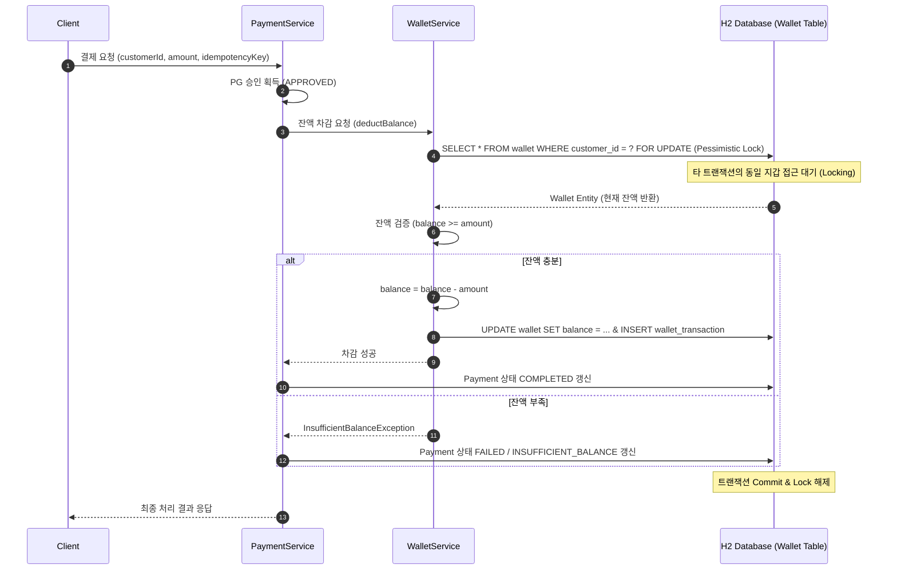
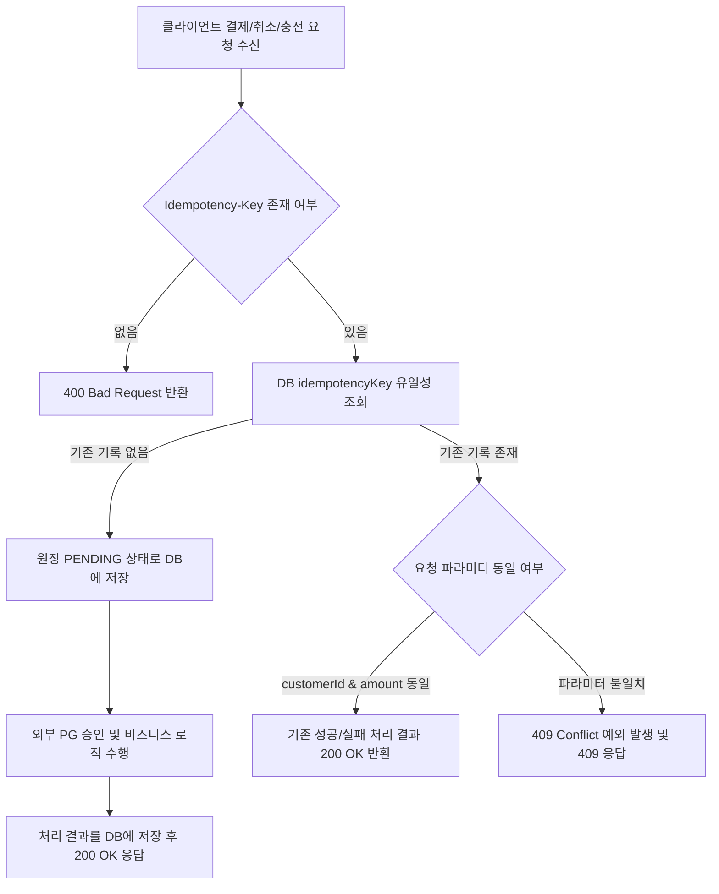
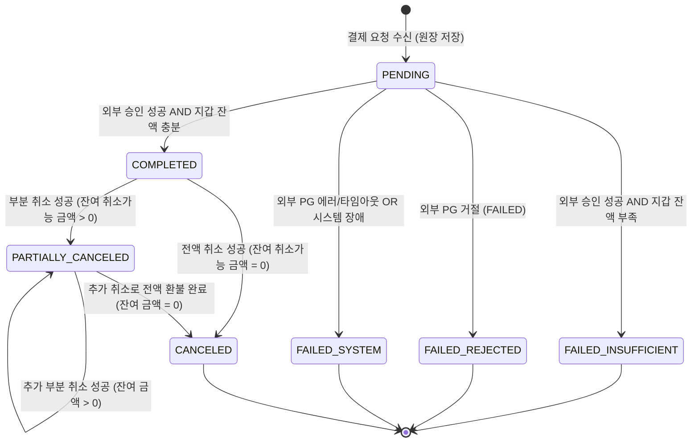

# 상세 아키텍처 정의서 (Detailed Software Architecture Document)

## 1. 문서 개요 및 시스템 목적

| 항목 | 내용 |
| --- | --- |
| 문서 작성 관점 | Software Architect / Lead System Architect |
| 시스템 명칭 | PG 연동 기반 백엔드 결제 및 지갑 원장 시스템 (Payment & Wallet Subsystem) |
| 핵심 목표 | 가상 외부 PG 연동, 원장 이력 추적성 확보, 비관적 락 기반 지갑 잔액 정합성 보장, 멱등성(Idempotency) 준수 및 외부 응답 데이터 암호화 보관 |
| 기술 기준선 | Java 17, Spring Boot 3.5.16, Spring Data JPA, H2 Database (In-Memory), Flyway, JUnit 5 |

---

## 2. 시스템 아키텍처 및 계층 구조 (Layered Architecture)

본 시스템은 Domain-Driven Design(DDD) 원칙과 Clean/Layered Architecture 개념을 결합하여 계층 간 결합도를 낮추고 테스트 가능성과 유지보수성을 극대화하도록 구성한다.

```
+-----------------------------------------------------------------------------------+
|                                 Presentation Layer                                |
|  - WalletController / PaymentController / PaymentQueryController                  |
|  - GlobalExceptionHandler (표준 ApiResponse<T> 직렬화 및 HTTP Status 매핑)         |
+-----------------------------------------------------------------------------------+
                                          |
                                          v
+-----------------------------------------------------------------------------------+
|                                 Application Layer                                 |
|  - PaymentService (결제/취소 전체 오케스트레이션 및 멱등성 검증)                  |
|  - WalletService (지갑 생성, 충전, 비관적 락 기반 잔액 차감/환불)                 |
|  - PaymentQueryService (고객용/운영자용 페이징 및 다이나믹 검색)                   |
+-----------------------------------------------------------------------------------+
                                          |
                     +--------------------+--------------------+
                     |                                         |
                     v                                         v
+------------------------------------------+  +-------------------------------------+
|              Domain Layer                |  |         Infrastructure Layer        |
|  - Wallet, WalletTransaction (Entity)    |  |  - FakePgClient (가상 PG 연동 모듈)  |
|  - Payment, PaymentCancel (Entity)       |  |  - AesPayloadEncryptor (AES-256)   |
|  - PgResponseLog (Entity)                |  |  - Flyway (DB Schema Migration)     |
|  - Domain Value Objects & Enums          |  |  - Spring Data JPA Repositories     |
+------------------------------------------+  +-------------------------------------+
```

### 계층별 주요 역할 및 책무

1. **Presentation Layer**:
   * 클라이언트 요청 수신 및 Bean Validation 검증.
   * `Idempotency-Key` 헤더 추출 및 Application Layer 전달.
   * 공통 `ApiResponse<T>` 포맷 형태로 응답 직렬화.
2. **Application Layer**:
   * **Spring Event 기반 트랜잭션 경계 분리 (`@TransactionalEventListener AFTER_COMMIT`)**: 
     - 원장 `PENDING` 저장 트랜잭션이 성공적으로 DB에 `COMMIT`된 직후 이벤트를 발행하여 외부 PG 연동을 호출함.
     - 외부 HTTP 연동 시에는 이미 `PENDING` 트랜잭션이 Commit되고 DB 커넥션이 반납된 상태이므로, 외부 타임아웃/지연 발생 시에도 DB Connection Pool 고사(Exhaustion)를 원천 차단함.
     - Kafka 등 외부 브로커 도입에 따른 Over-engineering 및 운용 복잡성 대신, Spring 내장 Event 엔진을 활용하여 결합도를 낮추고 테스트 가능성을 극대화함. (자세한 배경은 ADR 0002 참조)
   * 비즈니스 유효성 검증(잔액 부족, 취소 가능 한도 초과 등) 및 멱등성 검증 (`409 Conflict`).
3. **Domain Layer**:
   * 엔티티 스스로의 상태 전이 검증 (`Payment.markCompleted()`, `Wallet.decreaseBalance()`).
   * 순수 비즈니스 규칙 캡슐화 (부동 소수점 오차 방지를 위한 `Long` 또는 `BigDecimal` 정수 연산).
4. **Infrastructure Layer**:
   * 가상 외부 PG 연동 (`FakePgClient`: 승인, 거절, 에러, 타임아웃 시뮬레이션).
   * 외부 응답 원문 암호화 (`AesPayloadEncryptor`: AES-256 GCM/CBC).
   * DB 마이그레이션 (`Flyway`를 이용해 애플리케이션 시작 시 인메모리 H2 스키마 자동 구축).

---

## 3. 핵심 아키텍처 메커니즘 및 상세 설계

### 3.1 동시성 제어 전략 (Concurrency Control Architecture)

동일 지갑에 대한 동시 다발적인 결제/충전 요청 환경에서 잔액의 부적합(Negative Balance / Lost Update)을 방지하기 위해 **DB 레벨 비관적 락(Pessimistic Lock)**을 채택한다.



* **적용 메서드**: `WalletRepository.findByCustomerIdWithLock(String customerId)`
* **JPA 설정**: `@Lock(LockModeType.PESSIMISTIC_WRITE)`
* **락 타임아웃**: `@QueryHints({@QueryHint(name = "jakarta.persistence.lock.timeout", value = "3000")})` (3초 대기 후 타임아웃 예외 발생)
* **동시 취소 확장**: 동일 원 결제에 대한 부분 취소 경합은 `PaymentRepository.findByIdWithLock(Long paymentId)`의 `PESSIMISTIC_WRITE`로 누적 취소 금액 갱신을 직렬화한다.
* **잠금 순서**: 취소 완료 트랜잭션은 원 결제 잠금 후 지갑 잠금을 획득하는 순서를 일관되게 적용하여 교착 위험을 줄인다.

---

### 3.2 멱등성(Idempotency) 검증 및 처리 아키텍처

클라이언트 재시도나 중복 클릭으로 인한 중복 결제를 차단하기 위해 **글로벌 유일 멱등키 전략**을 구현한다.



* **글로벌 멱등성 선점**:
  * `idempotency_record.idempotency_key`를 기본키로 사용하여 결제·취소·충전 업무를 넘어 시스템 전체에서 키를 원자적으로 선점한다.
  * 요청 유형과 SHA-256 요청 지문을 비교해 동일 재요청과 `IDEMPOTENCY_CONFLICT`를 구분한다.
* **업무 테이블 방어적 유일성 제약**:
  * `payment.idempotency_key` (UNIQUE INDEX)
  * `payment_cancel.idempotency_key` (UNIQUE INDEX)
  * `wallet_transaction.idempotency_key` (UNIQUE INDEX)

---

### 3.3 결제 상태 전이 모델 (Payment State Machine)

결제 원장은 명확한 상태 전이 규칙을 준수하며 비정상적인 상태 변경을 차단한다.



#### 상태 및 실패 사유 매핑표
| 최종 내부 상태 | 실패 사유 (`failure_reason`) | 발생 조건 |
| --- | --- | --- |
| `COMPLETED` | `null` | 외부 PG 승인(`APPROVED`) + 지갑 잔액 충분하여 차감 완료 |
| `FAILED` | `INSUFFICIENT_BALANCE` | 외부 PG 승인(`APPROVED`) + 지갑 잔액 부족 |
| `FAILED` | `EXTERNAL_PAYMENT_REJECTED` | 외부 PG 거절(`FAILED`) |
| `FAILED` | `SYSTEM_ERROR` | 외부 PG 오류(`ERROR`), 타임아웃, 또는 내부 DB/시스템 장애 |
| `PARTIALLY_CANCELED`| `null` | 취소 요청 성공 + 누적 취소 금액 < 원 결제 금액 |
| `CANCELED` | `null` | 취소 요청 성공 + 누적 취소 금액 = 원 결제 금액 |

---

### 3.4 외부 PG 응답 원문 암호화 아키텍처 (Security Architecture)

외부 PG사의 응답 원문(Raw JSON)에는 민감정보나 운영용 개인정보가 포함될 수 있으므로, 요구사항 `EXT-002`에 따라 **애플리케이션 수준 암호화**를 적용한다.

* **암호화 알고리즘**: **AES-256-GCM (`AES/GCM/NoPadding`)**, 12바이트 무작위 IV와 128비트 인증 태그를 사용한다.
* **저장 포맷**: `v1:{Base64(IV)}:{Base64(ciphertext+tag)}`로 버전을 포함하여 향후 키 회전과 포맷 변경을 구분한다.
* **키 관리**: Base64로 인코딩된 정확히 32바이트 Secret Key를 소스코드나 DB에 저장하지 않고 환경 변수(`PAYMENT_ENCRYPTION_SECRET`)를 통해 실행 타임에 주입한다.
* **로그 분리 저장**: General Application Log(Console/File)에는 민감 원문을 절대 출력하지 않고, 전용 테이블 `pg_response_log`의 `encrypted_payload` 컬럼에 저장함.

---

## 4. 데이터베이스 물리 스키마 정의 (Flyway DDL Script)

애플리케이션 시작 시 Flyway(`db/migration/V1__init_schema.sql`)에 의해 자동으로 생성되는 DDL 스키마 정의이다.

```sql
-- 1. 고객(사용자) 테이블
CREATE TABLE customer (
    id BIGINT AUTO_INCREMENT PRIMARY KEY,
    customer_id VARCHAR(64) NOT NULL UNIQUE,
    name VARCHAR(64) NOT NULL,
    email VARCHAR(128),
    created_at TIMESTAMP NOT NULL,
    updated_at TIMESTAMP NOT NULL
);
CREATE UNIQUE INDEX idx_customer_customer_id ON customer(customer_id);

-- 2. 지갑 테이블
CREATE TABLE wallet (
    id BIGINT AUTO_INCREMENT PRIMARY KEY,
    customer_id VARCHAR(64) NOT NULL UNIQUE,
    balance BIGINT NOT NULL DEFAULT 0,
    created_at TIMESTAMP NOT NULL,
    updated_at TIMESTAMP NOT NULL,
    CONSTRAINT fk_wallet_customer FOREIGN KEY (customer_id) REFERENCES customer(customer_id)
);
CREATE UNIQUE INDEX idx_wallet_customer_id ON wallet(customer_id);

-- 3. 지갑 거래 이력 테이블
CREATE TABLE wallet_transaction (
    id BIGINT AUTO_INCREMENT PRIMARY KEY,
    wallet_id BIGINT NOT NULL,
    transaction_type VARCHAR(32) NOT NULL, -- TOP_UP, PAYMENT, REFUND
    amount BIGINT NOT NULL,
    balance_after BIGINT NOT NULL,
    payment_id BIGINT,
    cancel_id BIGINT,
    idempotency_key VARCHAR(128) UNIQUE,
    created_at TIMESTAMP NOT NULL,
    CONSTRAINT fk_wallet_tx_wallet FOREIGN KEY (wallet_id) REFERENCES wallet(id)
);

-- 4. 결제 원장 테이블
CREATE TABLE payment (
    id BIGINT AUTO_INCREMENT PRIMARY KEY,
    idempotency_key VARCHAR(128) NOT NULL UNIQUE,
    customer_id VARCHAR(64) NOT NULL,
    amount BIGINT NOT NULL,
    status VARCHAR(32) NOT NULL, -- PENDING, COMPLETED, PARTIALLY_CANCELED, CANCELED, FAILED
    failure_reason VARCHAR(64), -- INSUFFICIENT_BALANCE, SYSTEM_ERROR, EXTERNAL_PAYMENT_REJECTED
    accumulated_cancel_amount BIGINT NOT NULL DEFAULT 0,
    created_at TIMESTAMP NOT NULL,
    updated_at TIMESTAMP NOT NULL,
    CONSTRAINT fk_payment_customer FOREIGN KEY (customer_id) REFERENCES customer(customer_id)
);
CREATE INDEX idx_payment_customer_created ON payment(customer_id, created_at DESC);
CREATE INDEX idx_payment_ops_search ON payment(status, created_at DESC);

-- 4. 취소 거래 테이블
CREATE TABLE payment_cancel (
    id BIGINT AUTO_INCREMENT PRIMARY KEY,
    payment_id BIGINT NOT NULL,
    idempotency_key VARCHAR(128) NOT NULL UNIQUE,
    cancel_type VARCHAR(32) NOT NULL, -- FULL, PARTIAL
    amount BIGINT NOT NULL,
    status VARCHAR(32) NOT NULL, -- PENDING, COMPLETED, FAILED
    failure_reason VARCHAR(64),
    pg_cancel_transaction_id VARCHAR(128),
    created_at TIMESTAMP NOT NULL,
    completed_at TIMESTAMP,
    CONSTRAINT fk_cancel_payment FOREIGN KEY (payment_id) REFERENCES payment(id)
);

-- 5. 외부 PG 응답 로그 테이블 (원문 암호화 저장)
CREATE TABLE pg_response_log (
    id BIGINT AUTO_INCREMENT PRIMARY KEY,
    payment_id BIGINT NOT NULL,
    pg_transaction_id VARCHAR(128),
    pg_response_code VARCHAR(32),
    encrypted_payload CLOB NOT NULL,
    received_at TIMESTAMP NOT NULL,
    CONSTRAINT fk_pg_log_payment FOREIGN KEY (payment_id) REFERENCES payment(id)
);

-- 6. 결제 아웃박스 테이블 (Outbox-Ready Pattern)
CREATE TABLE payment_outbox (
    id BIGINT AUTO_INCREMENT PRIMARY KEY,
    payment_id BIGINT NOT NULL,
    idempotency_key VARCHAR(128) NOT NULL,
    event_type VARCHAR(64) NOT NULL,
    payload CLOB NOT NULL,
    status VARCHAR(32) NOT NULL, -- INIT, PUBLISHED, FAILED
    retry_count INT NOT NULL DEFAULT 0,
    created_at TIMESTAMP NOT NULL,
    updated_at TIMESTAMP NOT NULL
);
CREATE INDEX idx_outbox_status_created ON payment_outbox(status, created_at);

-- V3: 시스템 전체 멱등키 선점 원장
CREATE TABLE idempotency_record (
    idempotency_key VARCHAR(128) PRIMARY KEY,
    request_type VARCHAR(32) NOT NULL,
    request_fingerprint VARCHAR(64) NOT NULL,
    resource_id BIGINT,
    created_at TIMESTAMP NOT NULL,
    updated_at TIMESTAMP NOT NULL
);
```

---

## 5. 조회 API 및 응답 보안 / 페이징 아키텍처

1. **고객용 조회 API (`GET /api/v1/customers/{customerId}/payments`)**:
   * **소유권 검증**: 요청 URL/헤더의 `customerId`와 결제 원장의 `customerId` 일치 검증.
   * **정보 은닉(Data Masking)**: 외부 응답 원문(`encrypted_payload`), 내부 PG 연동 상세 에러 등은 노출하지 않고 비즈니스 상태/금액/일시만 반환.
2. **운영자용 검색 API (`GET /api/v1/ops/payments`)**:
   * **다이나믹 필터링**: `paymentId`, `customerId`, `status`, `failureReason`, `startDate`, `endDate` 조합 검색.
   * **운영 추적성**: 취소 거래 목록, 지갑 거래 참조 ID, PG 응답 로그 ID 포함.
3. **공통 페이징 규격**:
   * Page index: 1-based (클라이언트 1페이지 요청 -> JPA `PageRequest.of(page - 1, size)`)
   * 기본 Size: 20건, 최대 Size: 100건 제한
   * 정렬: `created_at DESC` 기본 적용

---

## 6. 예외 처리 및 공통 응답 규격 (Error & Response Architecture)

### 공통 성공 응답 (`ApiResponse<T>`)
```json
{
  "code": "OK",
  "message": "정상적으로 처리되었습니다.",
  "returnObject": { ... }
}
```

### 공통 오류 응답 (`ApiResponse<Void>`)
```json
{
  "code": "INSUFFICIENT_BALANCE",
  "message": "지갑 잔액이 부족합니다.",
  "returnObject": null
}
```

#### 주요 비즈니스 오류 코드 정의
| 업무 오류 코드 (`code`) | HTTP Status | 사유 및 설명 |
| --- | --- | --- |
| `WALLET_NOT_FOUND` | `404 Not Found` | 지갑이 존재하지 않는 고객의 결제/충전/조회 요청 |
| `DUPLICATE_WALLET` | `400 Bad Request` | 이미 지갑이 존재하는 고객의 재생성 요청 |
| `IDEMPOTENCY_CONFLICT` | `409 Conflict` | 동일 멱등키로 요청 파라미터가 다른 중복 요청 |
| `INSUFFICIENT_BALANCE` | `400 Bad Request` | 잔액 부족 |
| `INVALID_CANCEL_AMOUNT` | `400 Bad Request` | 취소 금액이 잔여 취소가능 금액 초과 또는 0원 이하 |
| `PAYMENT_NOT_FOUND` | `404 Not Found` | 존재하지 않는 결제 건 조회/취소 |
| `SYSTEM_ERROR` | `500 Internal Server Error` | PG 타임아웃, DB 장애 등 내부 시스템 오류 |

---

## 7. 아키텍처 품질 및 비기능 특성 검증 전략

1. **정합성 테스트**: JUnit 5 + `ExecutorService` (30개 동시 스레드)를 이용해 동일 지갑에 대한 동시 결제/충전 시 비관적 락으로 인해 잔액이 정확히 차감되고 음수가 되지 않음을 검증.
2. **트랜잭션 격리 및 외부 타임아웃 시뮬레이션**: `FakePgClient`를 통해 타임아웃 발생 시 DB에 `FAILED/SYSTEM_ERROR`가 정상 기록되고 커넥션 락이 신속히 해제되는지 테스트.
3. **독립적 실행 환경**: 인메모리 H2 DB와 Flyway 스키마 자동 생성을 활용해 외부 환경 의존성 없이 `./gradlew test`만으로 전체 인수 테스트 검증 가능.
